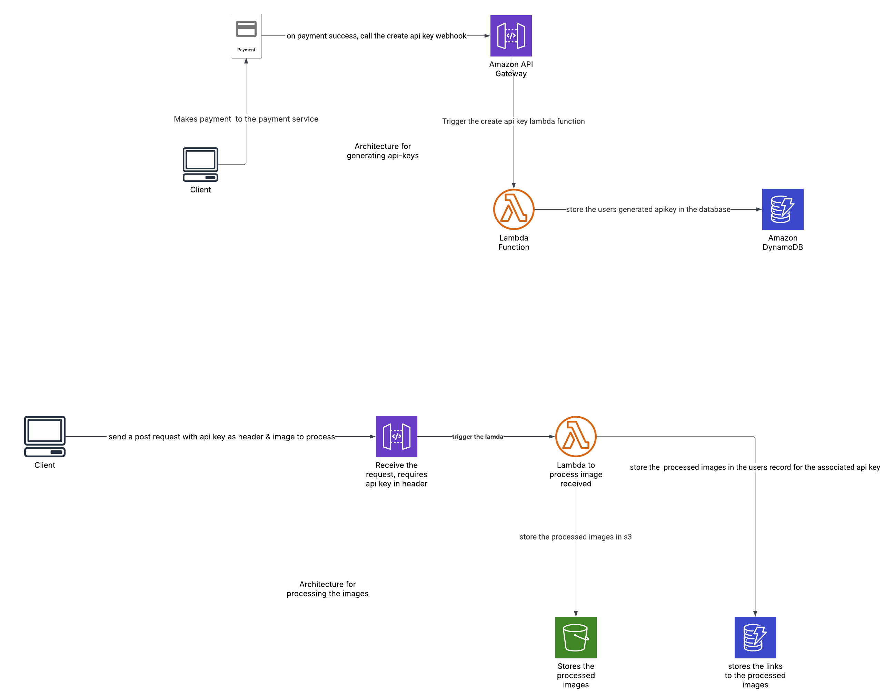

# About the Project

The RGB Splitting API is a cloud-based image processing solution that enables users to upload images and decompose them into their individual red, green, and blue color channels. Built on a serverless architecture, the system leverages AWS Lambda, API Gateway, DynamoDB, and S3 to deliver scalable, cost-effective, and highly available image processing capabilities.

# Core Features

- Secure Webhook for API Key Generation – A webhook is triggered upon successful payment, creating and storing the user's API key.
- Image Processing Service – Users send an image along with their API key as a header, and the system extracts the red, green & blue variants of the image & saves them to s3

## Tech Stack

- AWS Lambda - Two lambdas are used in this project. One for the image processing and one for api key generation
- AWS S3 - This is used to store uploaded & processed images
- AWS Dynamo Db - This is used to store the users api key & the link to the images they have generated with that particular api key
- AWS Api Gateway - This acts as a reverse proxy to the lambda.

## The System Architecture Diagram

