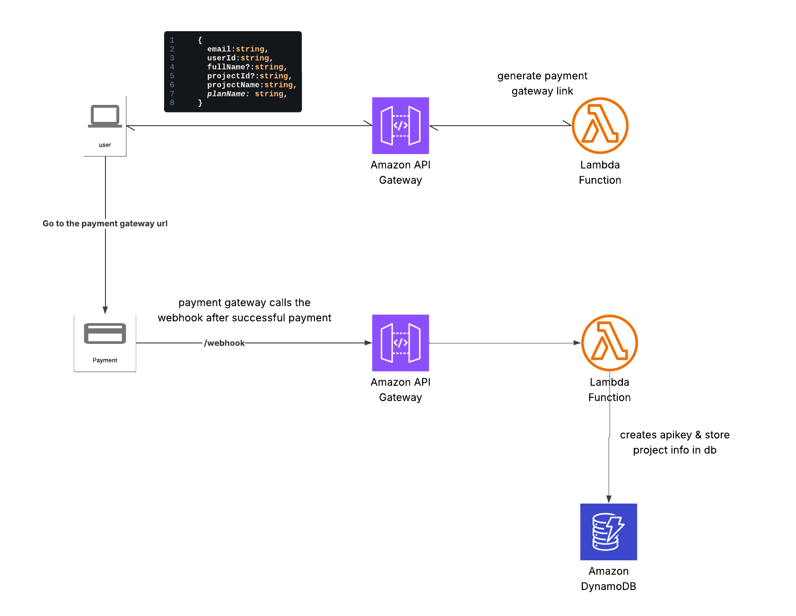

# Subscription Logic

## Context

Users want to be able to subscribe to the available plans.

## Flow

1. Users select the plan they want to pay for on the front end.
2. If they selected the free plan, we check if they have under 3 active free projects, if they do, then we immediately create the apikey, attach it to the usage plan & store the details in the db, then return. If they do not, we return an error (400) to the user.
3. If they selected a paid plan, then we generate a payment intent & return the payment intent to the user.
4. The user redirects to the payment intent & pays the full amount shown.
5. Once the users pays the amount, the payment gateway calls our webhook endpoint **/webhook** with all the projects info in the metadata & then we create their project in the dynamodb table.

# Resubscription Logic

## Context

Users with active paid subscriptions need to be automatically resubscribed when their next billing date is reached. This is to ensure that users do not lose access to their projects & images when their subscription expires.

## Flow

1. Every 7 days an event bridge schedule rule triggers a lambda function **(resubscribe-handler)**
2. The lambda function fetches a max of 2k non-free active projects whos billing date has been reached.
3. It then loops through each project found & tries to charge the card attached to the project.
4. If the charge is successful, then their billing date is updated to 1 month from the current date of the charge.
5. If the charge fails due to network issues, then we try again (max 2 times) with a delay of 1 second between each attempt, if it still fails, then we send the project to the downgrade queue so their project can be downgraded to the free plan.
6. If the charge fails due to any other reason, the project is sent to the downgrade queue immediately.
7. Users would only be downgraded to free plan if they have less than 3 active free projects, if they do not, the project is immediately cancelled.
8. If there are still more projects to process after we have finished processing the first batch, we send a message to the resubscribe queue with the last evaluated key so we can process the next batch of projects pending resubscription. The resubscribe queue then triggers the resubscribe handler again & this process is repeated until all projects have been successfully processed or downgraded.

# Upgrade Logic

## Context

Users need to be able to upgrade their projects to any plan of their choice.

## Flow

1. Users select the project they want to upgrade on the frontend.
2. If they selected the free plan, we check if they have under 3 active free projects, if they do, then we immediately migrate their api key to the free usage plan, update the project in dynamoDb & return the response to the user. If they do not, we return an error to the user.
3. If they selected a paid plan, then we call the payment gateway & allow the user pay the amount shown.
4. Once the users pays the amount, the payment gateway calls our webhook endpoint **/webhook** with the projectId in the metadata, we get the project info from dynamoDb & migrate their apikey to the usage plan they had just paid for.
5. We then update the project in dynamoDb to reflect the new plan.
